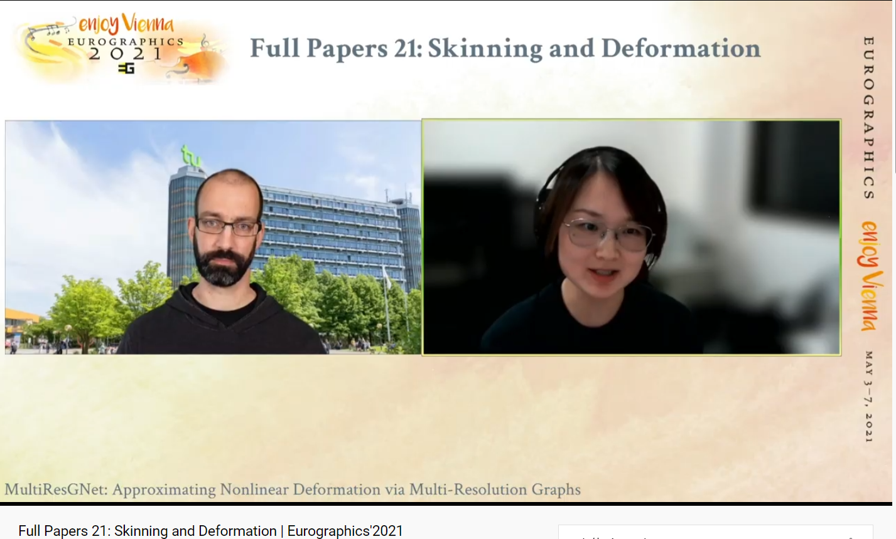

Eurographics’2021, was taken place on May 3 − 7, 2021. Because of the COVID-19, it was organized as a purely virtual event in Vienna. The presentation was prerecoreded and broadcast via YouTube, the discussions follwing the talks (the Q&A) were live.



<!--  -->

